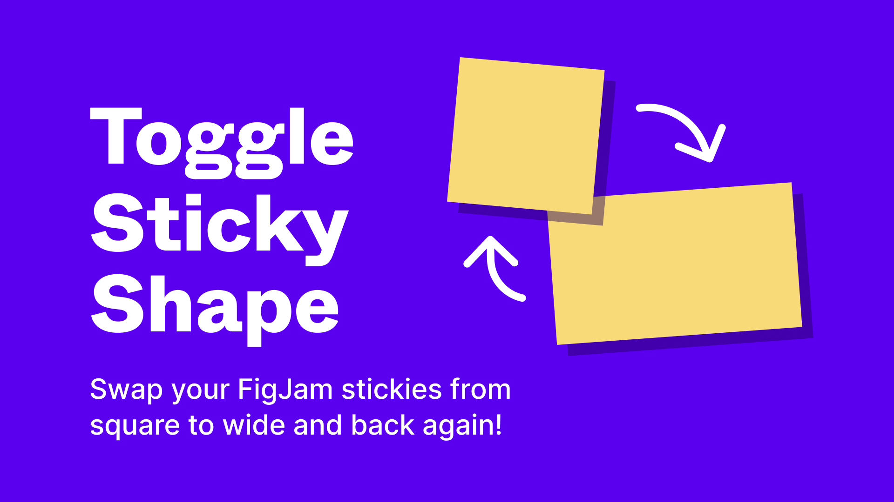
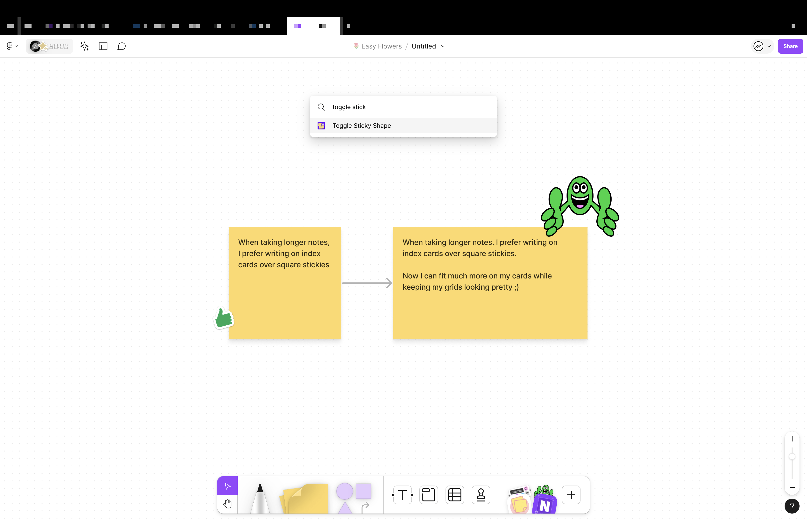

# Toggle Sticky Shape – Figma plugin

Get started by adding from [the figma community page](https://www.figma.com/community/plugin/1377840729001403353/toggle-sticky-shape), or by searching Toggle Sticky Shape in the FigJam plugin list.

## Using the plugin:

- Select your stickies you want to swap
- Click the Toggle Sticky Shape button from the plugin list
- After first run or saving the plugin, you can now run the command from Quick Actions (⌘+/)

